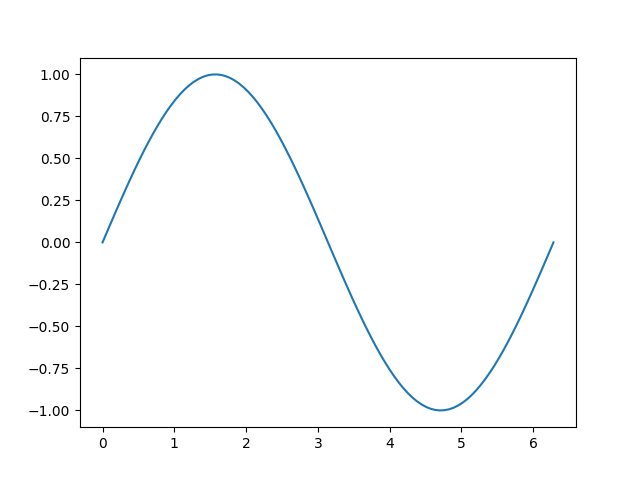

# Introduction

Python has not been designed with number crunching in mind. In fact, if you try to use lists for numeric computing, you will soon notice several caveats:

- Operations with lists are slow
- Lists do not store numeric data efficiently
- Performing elementwise operations is cumbersome

Consider the following example, a list `x` consisting of numbers from 1 to 10:

```python
>>> x = [1, 2, 3, 4, 5, 6, 7, 8, 9, 10]
```

Let's try to add `1` to each element in the list. Intuitively, we might try this as follows:

```python
>>> x + 1
```
```
TypeError: can only append array (not "int") to array
```

However, this results in an error. Python is trying to concatenate the list `x` with the integer `1`, which does not work (the `+` operator is used to concatenate two lists).

We could use a list comprehension to perform the calculation as follows:

```python
>>> [e + 1 for e in x]
```
```
[2, 3, 4, 5, 6, 7, 8, 9, 10, 11]
```

Although this worked, it is quite a lot to type for such a (seemingly) simple operation. Using the built-in `map()` function does not make things simpler either:

```python
list(map(lambda x: x + 1, x))
```
```
[2, 3, 4, 5, 6, 7, 8, 9, 10, 11]
```

In summary, these examples show that because lists are general-purpose containers, they are not suitable for numeric computations. List operations are also pretty slow when compared to numeric arrays in other programming languages (such as C, Fortran, or Julia). Finally, lists use a lot of memory compared to numeric arrays in other languages.

Even though the `array` module in the standard library features an `array` data type (which stores elements of the same type much more efficiently than lists), elementwise operations with a simple syntax are still not supported.

This is where [NumPy](https://numpy.org/) enters the stage. The importance of this third-party package cannot be understated: without NumPy, Python would not be one of the most popular programming language for data science. Many scientific packages like SciPy, Pandas, and Scikit-Learn are based on NumPy under the hood, so it makes sense to learn the basics even if you do not plan to work with NumPy directly. This is the goal of this chapter.


# The n-dimensional array

NumPy provides an efficient container type for numeric data. Before we discuss it in detail, here is how you can use it in our previous example:

```python
>>> import numpy as np
>>> x = np.array([1, 2, 3, 4, 5, 6, 7, 8, 9, 10])
>>> x + 1
```
```
array([ 2,  3,  4,  5,  6,  7,  8,  9, 10, 11])
```

Voilà – we added `1` to each element in the array by just typing `x + 1`, no list comprehensions or other gymnastics necessary.

Before we can use NumPy, we need to import it. By convention, this is done by `import numpy as np` (as in the example we just saw).

The most important thing that NumPy provides is the n-dimensional homogeneous array (or short ndarray or just array). This data type is a highly efficient container for homogeneous data, which means that all elements must be the same type (typically, elements are numeric types such as integers or floats). The data is also structured into dimensions (also called axes), it can be one-dimensional, two-dimensional, three-dimensional, and so on. In general, an array can be n-dimensional, which means that there is no limit to the number of dimensions.

Let's take a look at our array `x`:

```python
>>> type(x)
```
```
<class 'numpy.ndarray'>
```

## The `dtype` attribute
Each object of type `numpy.ndarray` (short ndarray) has a `dtype` attribute, which contains the type of all its elements. In our example, all elements are integers (represented by 64 bits):

```
>>> x.dtype
```
```
dtype('int64')
```

## The `shape` attribute
Our array looks like a list, so it should have only one dimension. The `shape` attribute contains the size of all dimensions:

```
>>> x.shape
```
```
(10,)
```

Indeed, the array has one dimension containing 10 elements.

## Other useful attributes
In addition to `dtype` and `shape`, the following attributes are also available:

- `ndim` contains the number of dimensions (axes) (this is equal to the length of the `shape` tuple)
- `size` contains the number of elements in the array (this is equal to the product of the individual `shape` elements)
- `itemsize` contains the size of one element in bytes (this is normally apparent from the `dtype`, for example `np.float64` means that one element occupies 64 bits, which corresponds to 8 bytes)

These are the attributes for our example array `x`:

```python
>>> x.ndim
```
```
1
```
```python
>>> x.size
```
```
10
```
```python
>>> x.itemsize
```
```
8
```

# Creating arrays
## Using existing sequence-like objects
We already saw one way to create an array: the `np.array()` function takes a sequence (such as a list) and produces a NumPy array. The following example generates a one-dimensional array:

```python
>>> x = np.array([1, 2, 3, 4, 5, 6, 7, 8, 9, 10])
>>> x
```
```
array([ 1,  2,  3,  4,  5,  6,  7,  8,  9, 10])
```

If we pass a list of lists, we can create a two-dimensional array:

```python
>>> y = np.array([[1, 2], [3, 4], [5, 6], [7, 8], [9, 10]])
>>> y
```
```
array([[ 1,  2],
       [ 3,  4],
       [ 5,  6],
       [ 7,  8],
       [ 9, 10]])
```

This array consists of five rows and two columns, as can be verified by inspecting its shape:

```python
>>> y.shape
```
```
(5, 2)
```

In other words, the first dimension contains five elements, and the second dimension contains two elements. In any n-dimensional array, the last dimension can be interpreted as columns, and the second last dimension corresponds to rows. Nested lists are mapped to additional dimensions, so here's how to create a three-dimensional array:

```python
>>> z = np.array([[[1, 2, 3], [4, 5, 6]], [[7, 8, 9], [10, 11, 12]]])
>>> z
```
```
array([[[ 1,  2,  3],
        [ 4,  5,  6]],

       [[ 7,  8,  9],
        [10, 11, 12]]])
```

The shape of `z` is:

```python
>>> z.shape
```
```
(2, 2, 3)
```

This can be interpreted as two tables with two rows and three columns each (remember that the last two dimensions correspond to rows and columns).

All of the arrays that we created contain integers (because our lists that we provided to initialize the arrays also contained integers):

```python
>>> x.dtype, y.dtype, z.dtype
```
```
(dtype('int64'), dtype('int64'), dtype('int64'))
```

We can also create arrays consisting of floating point numbers, for example:

```python
>>> f = np.array([[1.1, 5.2, -8.3], [-4.4, 15.5, 9.6]])
```
```
array([[ 1.1,  5.2, -8.3],
       [-4.4, 15.5,  9.6]])
```
```python
>>> f.dtype
```
```
dtype('float64')
```

We can even specify the desired data type:

```python
>>> g = np.array([1, 2, 3], dtype=float)
>>> g
```
```
array([1., 2., 3.])
```

Notice the decimal points in the output; the data type is therefore:

```python
>>> g.dtype
```
```
dtype('float64')
```

Besides the standard Python data types `int` and `float`, more specific types available as `np.int32`, `np.int64`, `np.float32`, `np.float64`, and so on, are also supported. In fact, `int` and `float` map to `np.int64` and `np.float64`, respectively.

## Creating sequences
### Range of numbers
The `np.arange()` function creates an array with equally-spaced numbers:

```python
>>> np.arange(10)
```
```
array([0, 1, 2, 3, 4, 5, 6, 7, 8, 9])
```

This function accepts custom values for the start, end, and step size of the sequence:

```python
>>> np.arange(start=3, stop=11, step=0.8)
```
```
array([ 3. ,  3.8,  4.6,  5.4,  6.2,  7. ,  7.8,  8.6,  9.4, 10.2])
```

### Linearly-spaced or log-spaced numbers
If you need a specific number of equally-spaced values within a given range, `np.linspace()` and `np.logspace()` are useful. For example, the following command creates an array with 8 values between 13 and 14:

```python
>>> np.linspace(start=13, stop=14, num=8)
```
```
array([13.        , 13.14285714, 13.28571429, 13.42857143, 13.57142857,
       13.71428571, 13.85714286, 14.        ])
```

This function can be helpful when you want to evaluate a function at many points. The following example plots a complete period of a sine using 100 equally-spaced points:

```python
>>> import matplotlib.pyplot as plt
>>> x = np.linspace(0, 2 * np.pi, 100)  # 100 values from 0 to 2𝜋
>>> plt.plot(x, np.sin(x))
```



Note that we use Matplotlib to plot the sine function values for these 100 points with a line graph, but don't worry too much about the plot right now. We will discuss Matplotlib in more detail later.

Next, let's create a logarithmically-spaced array with 16 numbers ranging from 10⁻¹ to 10⁷:

```python
>>> np.logspace(start=-1, stop=7, num=16)
```
```
array([1.00000000e-01, 3.41454887e-01, 1.16591440e+00, 3.98107171e+00,
       1.35935639e+01, 4.64158883e+01, 1.58489319e+02, 5.41169527e+02,
       1.84784980e+03, 6.30957344e+03, 2.15443469e+04, 7.35642254e+04,
       2.51188643e+05, 8.57695899e+05, 2.92864456e+06, 1.00000000e+07])
```

### Empty, zeros, ones, and related arrays
Sometimes, it is necessary to create an array consisting of all zeros, ones, or any arbitrary fixed value. This can be achieved with `np.zeros()`, `np.ones()`, and `np.full()`. If you only want to pre-allocate an array of a given size and do not care which values it contains initially, you can use `np.empty()`.

```python
>>> np.zeros((2, 3))  # 2 rows, 3 columns
```
```
array([[0., 0., 0.],
       [0., 0., 0.]])
```

The default data type is `np.float64` (a floating point number with 64 bits, also known as double), but you can specify the desired type with the `dtype` argument:

```python
>>> np.zeros((2, 3), dtype=np.int64)
```
```
array([[0, 0, 0],
       [0, 0, 0]])
```

Creating an array with all one works similarly:

```python
>>> np.ones((3, 3))
```
```
array([[1., 1., 1.],
       [1., 1., 1.],
       [1., 1., 1.]])
```

Next, we create an array filled with `61`:

```python
>>> np.full((2, 2), 61)
```
```
array([[61, 61],
       [61, 61]])
```

If we only want to allocate an array and do not care about its initial values (which is usually a bit faster than filling with some predefined value):

```python
>>> np.empty((4, 3))
```
```
array([[13.        , 13.09090909, 13.18181818],
       [13.27272727, 13.36363636, 13.45454545],
       [13.54545455, 13.63636364, 13.72727273],
       [13.81818182, 13.90909091, 14.        ]])
```

Note that those values are arbitrary and might be different on your computer, so we have to populate the array later with the desired values.

Finally, `np.eye()` is a nice shortcut to create a square "identity" array (with ones on the diagonal and zeros elsewhere):

```python
>>> np.eye(5)
```
```
array([[1., 0., 0., 0., 0.],
       [0., 1., 0., 0., 0.],
       [0., 0., 1., 0., 0.],
       [0., 0., 0., 1., 0.],
       [0., 0., 0., 0., 1.]])
```

## Random numbers
The `numpy.random` module provides functions to generate (pseudo-)random numbers from a variety of distributions. This works as follows: first, we create a generator, which we can then use to generate random numbers drawn from a specific probability distribution. In the following example, we use the default generator provided by `default_rng()`. We also set the random seed of this generator (`42` in this example, but the specific value does not matter), which means that we will get the exact same random numbers every time we run our code. This is important to facilitate reproducable results.

```python
>>> from numpy.random import default_rng
>>> rng = default_rng(42)
>>> x1 = rng.standard_normal(10)
>>> x2 = rng.uniform(size=(2, 2))
>>> x3 = rng.integers(low=-3, high=99, size=(2, 5))
```

```python
>>> x1
```
```
array([ 0.30471708, -1.03998411,  0.7504512 ,  0.94056472, -1.95103519,
       -1.30217951,  0.1278404 , -0.31624259, -0.01680116, -0.85304393])
```

```python
>>> x2
```
```
array([[0.37079802, 0.92676499],
       [0.64386512, 0.82276161]])
```

```python
>>> x3
```
```
array([[52, 42, 42, 20,  6],
       [53, 87,  3, 84, 81]])
```

# Shape and reshape
Every array has a certain shape, which determines how its values are structured. The desired shape can be passed as an argument when creating an array, but it can also be changed later on. The `shape` attribute of an array returns the current shape as a tuple, listing the number of elements in every dimension (also called axis).

We already saw how we can create various arrays with different shapes using their `shape` or `size` arguments (unfortunately, the parameter names are not consistent):

```python
>>> np.zeros(shape=(2, 3))
```
```
array([[0., 0., 0.],
       [0., 0., 0.]])
```
```python
>>> np.ones(shape=(3, 2))
```
```
array([[1., 1.],
       [1., 1.],
       [1., 1.]])
```
```python
>>> np.full(shape=(2, 4), fill_value=2)
```
```
array([[2, 2, 2, 2],
       [2, 2, 2, 2]])
```
```python
>>> np.empty(shape=(2, 3))
```
```
array([[1., 1., 1.],
       [1., 1., 1.]])
```

Functions that create arrays with random numbers use the `size` argument to specify the desired shape (in the following examples we are reusing the `rng` generator created in the previous section).

```python
>>> rng.standard_normal(size=(2, 5))
```
```
array([[ 0.87939797,  0.77779194,  0.0660307 ,  1.12724121,  0.46750934],
       [-0.85929246,  0.36875078, -0.9588826 ,  0.8784503 , -0.04992591]])
```
```python
>>> rng.uniform(size=(2, 2))
```
```
array([[0.75808774, 0.35452597],
       [0.97069802, 0.89312112]])
```
```python
>>> rng.integers(low=-3, high=99, size=(2, 5))
```
```
array([[66, 76, 74, 16, 34],
       [44, 47,  1, 52, 12]])
```

However, we can always change the current shape of an array to a new compatible shape. Here, compatible means that the total number of elements must stay the same, so we could reshape an array with 3 rows and 4 columns to have 6 rows and 2 columns (the total number of elements is always 12).

There are three main ways to change the shape of an array:

1. Assign a new shape to the `shape` attribute
2. Use the `resize()` method
3. Use the `reshape()` method

Let's take a look at these options with the following `(3, 4)` example array:

```python
>>> x = np.array([[1, 2, 3, 4], [5, 6, 7, 8], [9, 10, 11, 12]])
>>> x
```
```
array([[ 1,  2,  3,  4],
       [ 5,  6,  7,  8],
       [ 9, 10, 11, 12]])
```
```python
>>> x.shape
```
```
(3, 4)
```

If we wanted to reshape this array to have four 4 rows and 3 columns, we can directly manipulate its shape:

```python
>>> x.shape = (4, 3)
>>> x
```
```
array([[ 1,  2,  3],
       [ 4,  5,  6],
       [ 7,  8,  9],
       [10, 11, 12]])
```

This modifies the shape of the array in place. Note that the way the array is stored in memory does not change, so this is a very fast operation.

Another way to change the shape is to call the `resize()` method with the new shape, which will also modify the array in place:

```python
>>> x.resize((2, 6))
>>> x
```
```
array([[ 1,  2,  3,  4,  5,  6],
       [ 7,  8,  9, 10, 11, 12]])
```

Finally, the `reshape()` method works just like `resize()`, but it creates a copy of the array with the new shape (so it does *not* modify it in place):

```python
>>> x.reshape((3, 4))
```
```
array([[ 1,  2,  3,  4],
       [ 5,  6,  7,  8],
       [ 9, 10, 11, 12]])
```
```python
>>> x
```
```
array([[ 1,  2,  3,  4,  5,  6],
       [ 7,  8,  9, 10, 11, 12]])
```

Of course you can always re-assign the new array to the previous name like this:

```python
>>> x = x.reshape((3, 4))
>>> x
```
```
array([[ 1,  2,  3,  4],
       [ 5,  6,  7,  8],
       [ 9, 10, 11, 12]])
```

We do not even have to specify the complete shape when using the `reshape()` or `resize()` methods; because the total number of elements must stay the same, we can set one dimension in the new shape tuple to `-1`, which means that its size will be calculated automatically:

```python
>>> x.reshape((6, -1))  # -1 is inferred to mean 2 here
```
```
array([[ 1,  2],
       [ 3,  4],
       [ 5,  6],
       [ 7,  8],
       [ 9, 10],
       [11, 12]])
```


# Indexing and slicing
We can pull out one or more elements of an array using indexing and slicing. This works very similar to lists, at least for one-dimensional arrays. Let's start with a simple 1D array:

```python
>>> x = np.arange(3, 19, 2, dtype=np.int64)
>>> x
```
```
array([ 3,  5,  7,  9, 11, 13, 15, 17])
```

Python uses zero-based indexing, so the first element is given by:

```python
>>> x[0]
```
```
3
```

Similarly, we can index other positions of the array:

```python
>>> x[2]
```
```
7
```

Negative indexes count from the end of the array, so the last element is:

```python
>>> x[-1]
```
```
17
```

Slices pull out multiple elements and just like in lists use the `:` operator to indicate the desired range (and an optional step size):

```python
>>> x[1:5]
```
```
array([ 5,  7,  9, 11])
```

```python
>>> x[1:5:2]
```
```
array([5,  9])
```

```python
>>> x[::-1]
```
```
array([17, 15, 13, 11,  9,  7,  5,  3])
```

When there are more than one dimensions, we can provide indices or slices for each dimension separated by a comma:

```python
>>> y = np.arange(12).reshape((3, 4))
>>> y
```
```
array([[ 0,  1,  2,  3],
       [ 4,  5,  6,  7],
       [ 8,  9, 10, 11]])
```

```python
>>> y[1, 0]
```
```
4
```

```python
>>> y[1:, 1:3]
```
```
array([[ 5,  6],
       [ 9, 10]])
```

```python
>>> y[:, 3]  # last column
```
```
array([ 3,  7, 11])
```

```python
>>> y[1, :]  # second row
```
```
array([4, 5, 6, 7])
```

If you do not provide indices or slices for some axes (or just use `:`), these are considered complete slices (so all elements in the missing dimensions are selected):

```python
>>> y[0]  # first row, equivalent to y[0, :]
```
```
array([0, 1, 2, 3])
```

If you want to skip multiple axes, instead of providing a `:` for each axis, you can also use `...`. For example, let's create a five-dimensional array real quick:

```python
>>> x = np.arange(720).reshape((3, 4, 5, 2, 6))  # five dimensions (axes)
```

The following slices can be abbreviated using `...` notation:

- `x[1, 2, :, :, :]` is equal to `x[1, 2, ...]` and `x[1, 2]`
- `x[:, 1, :, :, 4]` is equal to `x[:, 1, ..., 4]`
- `x[:, :, :, :, 3]` is equal to `x[..., 3]`

## Fancy indexing
In contrast to lists, we can even use arrays (or lists) as indices inside the square brackets to pull out several individual elements. This is called fancy indexing.

```python
>>> x = np.arange(10, 20, dtype=np.int64)
>>> x
```
```
array([10, 11, 12, 13, 14, 15, 16, 17, 18, 19])
```
```python
>>> x[[1, 5, 1, 0]]  # elements 1, 5, 1, and 0
```
```
array([11, 15, 11, 10])
```

It is also possible to use boolean values in fancy indexing. This can be used to filter values in an array, because the result will contain only those values corresponding to `True` locations:

```python
>>> x[[True, False, False, False, True, False, True, False, False, True]]
```
```
array([10, 14, 16, 19])
```

```python
>>> x > 15  # boolean array
```
```
array([False, False, False, False, False, False,  True,  True,  True, True])
```
```python
>>> x[x > 15]
```
```
array([16, 17, 18, 19])
```

We can even use indexing in an assignment. For example, let's assume we wanted to set all odd numbers to `-1`:

```python
>>> x[x % 2 != 0] = -1  # % is the remainder operator
>>> x
```
```
array([10, -1, 12, -1, 14, -1, 16, -1, 18, -1])
```

# Array operations
## Elementwise operations
In general, NumPy performs operations elementwise. If two arrays have the same shape, this is pretty straightforward:

```python
>>> x = np.arange(1, 7).reshape((2, 3))
>>> x
```
```
array([[1, 2, 3],
       [4, 5, 6]])
```
```python
>>> y = np.arange(7, 13).reshape((2, 3))
>>> y
```
```
array([[ 7,  8,  9],
       [10, 11, 12]])
```

```python
>>> x + y
```
```
array([[ 8, 10, 12],
       [14, 16, 18]])
```
```python
>>> x - y
```
```
array([[-6, -6, -6],
       [-6, -6, -6]])
```
```python
>>> x * y
```
```
array([[ 7, 16, 27],
       [40, 55, 72]])
```
```python
>>> x / y
```
```
array([[0.14285714, 0.25      , 0.33333333],
       [0.4       , 0.45454545, 0.5       ]])
```

These operations are vectorized, which means that they are automatically applied to all array elements without us having to write a manual loop. Vectorized operations are extremely fast and efficient, they are basically as fast as in C or Fortran. Therefore, we should avoid loops whenever possible, because loops are really slow and inefficient in this context.

## Vector and matrix operations
Note that NumPy does not attach special meaning to 1D or 2D arrays. A 1D array is not interpreted as a vector, and neither is a 2D array interpreted as a matrix. However, it is of course possible to perform vector and matrix operations with special notation. Specifically, the dot product between two vectors can be computed with the `@` symbol:

```python
>>> a = np.array([1, 2, 3])
>>> b = np.array([4, 5, 6])
>>> a @ b
```
```
32
```

Similarly, the `@` operator computes matrix multiplication if the operands are 2D arrays:

```python
>>> A = np.arange(6).reshape((2, 3))
>>> B = np.arange(6).reshape((3, 2))
>>> A @ B
```
```
array([[10, 13],
       [28, 40]])
```

Note that if the shapes are not compatible with matrix multiplication (the number of columns of the first operand must equal the number of rows of the second operand), we get an error:

```python
>>> C = np.arange(10).reshape((2, 5))
>>> A @ C  # error!
```
```
ValueError: matmul: Input operand 1 has a mismatch in its core dimension 0, with gufunc signature (n?,k),(k,m?)->(n?,m?) (size 2 is different from 3)
```

In summary, we saw that if two arrays have the same shape, operations are performed elementwise. Things get a little more difficult when the two arrays have different shapes – we will discuss this so-called broadcasting soon. But before that, there's even more we can do with just a single array using special methods.

## Array methods
There are many array methods that perform some kind of computation across *all* elements (regardless of the shape), such as calculating the sum, minimum, maximum, or mean:

```python
>>> x = np.arange(1, 13).reshape((3, 4))
>>> x
```
```
array([[ 1,  2,  3,  4],
       [ 5,  6,  7,  8],
       [ 9, 10, 11, 12]])
```

```python
>>> x.sum()
```
```
78
```
```python
>>> x.mean()
```
```
6.5
```

However, we can also perform these operations only along specific dimensions. For example, by computing the sum over axis 0 (the rows), we get the column sums:

```python
>>> x.sum(axis=0)
```
```
array([15, 18, 21, 24])
```

Similarly, we can compute the row means if we perform the operation over the columns (axis 1):

```python
>>> x.mean(axis=1)
```
```
array([ 2.5,  6.5, 10.5])
```

Remember that the axis you specify will disappear from the result! This also works for more than one axis:

```python
>>> y = np.arange(60).reshape((4, 3, 5))  # four 3 x 5 arrays
>>> y.mean(axis=(1, 2))  # compute the means of the four arrays
```
```
array([ 7., 22., 37., 52.])
```

In this example, `y` has shape `(4, 3, 5)`. Because we compute the mean across axes `1` and `2` (remember that Python starts counting at zero), this leaves only axis `0`. Because axis `0` has four elements, we get four individual means.

## Universal functions
Other useful functions are directly available in the `numpy` namespace, for example `np.sin()`, `np.cos()`, `np.exp()`, `np.sqrt()`, and so on. They are vectorized (and therefore operate on all elements) and are referred to as *universal functions* (or short *ufuncs*).

# Broadcasting
Even when two array shapes are different, calculations still work if certain conditions are met. The rules for this so-called *broadcasting* are:

1. If two arrays have different shapes, the array with fewer dimensions will automatically get new dimensions with size 1 on the left until it matches the number of the larger array.
2. Dimensions with size 1 are automatically repeated to match the size of the largest array in that dimension. The corresponding value will be repeated.

If the shapes of the two arrays are the same after these two steps, NumPy is able to compute the result. If the dimensions do not match, the operation will result in an error ("operands could not be broadcast together").

Let's illustrate these rules with some examples:

```python
>>> x = np.array([1, 2, 3])  # shape (3,) -> (1, 3) -> (2, 3)
>>> y = np.ones((2, 3), dtype=int)  # shape (2, 3)
>>> x + y  # works
```
```
array([[2, 3, 4],
       [2, 3, 4]])
```

```python
>>> x = np.array([1, 2, 3])  # shape (3,) -> (1, 3) -> (2, 3)
>>> y = np.ones((2, 4), dtype=int)  # shape (2, 4)
>>> x + y  # does not work because shapes (2, 3) and (2, 4) do not match
```
```
array([[2, 3, 4],
       [2, 3, 4]])
```

```python
>>> x = np.arange(6).reshape((2, 3))  # shape (2, 3) -> (1, 2, 3) -> (3, 2, 3)
>>> y = np.arange(18).reshape((3, 2, 3))  # shape (3, 2, 3)
>>> x + y  # works
```
```
array([[[ 0,  2,  4],
        [ 6,  8, 10]],

       [[ 6,  8, 10],
        [12, 14, 16]],

       [[12, 14, 16],
        [18, 20, 22]]])
```

# Useful functions
This sections summarizes some useful functions that have not been mentioned already.

## Finding unique values
A common task in many data analysis pipelines is to determine the number of unique elements in an array. The `np.unique()` function does exactly that (and more):

```python
>>> x = np.array([5, 7, 2, 5, 1, 3, 5, 5, 2, 1, 7, 7, 2, 2])
>>> np.unique(x)
```
```
array([1, 2, 3, 5, 7])
```

It is also possible to count the number of items for each unique value:

```python
>>> np.unique(x, return_counts=True)
```
```
(array([1, 2, 3, 5, 7]), array([2, 4, 1, 4, 3]))
```

Used like this, the function returns a tuple, where the first element corresponds to the unique elements, and the second element contains their frequencies. In our example, we can quickly see that `1` occurs `2` times, `2` occurs `4` times, and so on.

## Repeating arrays
The `np.tile()` function creates a new array by repeating a given array a certain number of times:

```python
>>> a = np.eye(2, dtype=int)
>>> a
```
```
array([[1, 0],
       [0, 1]])
```
```python
>>> np.tile(a, 2)
```
```
array([[1, 0, 1, 0],
       [0, 1, 0, 1]])
```

```python
>>> np.tile(a, (2, 1))
```
```
array([[1, 0],
       [0, 1],
       [1, 0],
       [0, 1]])
```

```python
>>> np.tile(a, (2, 4))
```
```
array([[1, 0, 1, 0, 1, 0, 1, 0],
       [0, 1, 0, 1, 0, 1, 0, 1],
       [1, 0, 1, 0, 1, 0, 1, 0],
       [0, 1, 0, 1, 0, 1, 0, 1]])
```

## Sampling from an array
Given an array and a random generator, it is possible to create a random sample from the array (with or without replacement) using the `choice()` method of the random generator:

```python
>>> rng = np.random.default_rng(1)
>>> x = np.array([0, 1])
>>> rng.choice([0, 1], size=20)
```
```
array([0, 1, 1, 1, 0, 0, 1, 1, 0, 0, 1, 0, 0, 1, 0, 0, 1, 1, 0, 0])
```

## Shuffling an array
Similarly, the `shuffle()` method shuffles a given array in place:

```python
>>> x = np.arange(10)
>>> rng.shuffle(x)  # rng is defined in the previous example
>>> x
```
```
array([8, 3, 1, 6, 9, 7, 0, 2, 4, 5])
```


# Additional resources
The [official NumPy website](https://numpy.org/doc/stable/index.html) contains excellent documentation and many tutorials. I specifically recommend the following tutorials for beginners:

- [The absolute basics for beginners](https://numpy.org/doc/stable/user/absolute_beginners.html)
- [NumPy quickstart](https://numpy.org/doc/stable/user/quickstart.html)

If you are coming from MATLAB, this tutorial is for you:

- [NumPy for MATLAB users](https://numpy.org/doc/stable/user/numpy-for-matlab-users.html)

# Exercises
- [100 NumPy Exercises](https://github.com/rougier/numpy-100) ([Solutions](https://github.com/rougier/numpy-100/blob/master/100_Numpy_exercises_with_solutions.md))
